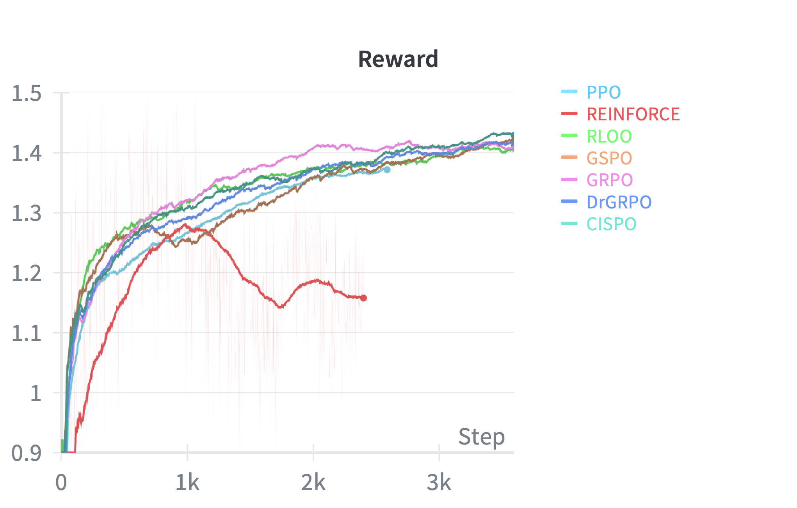

<p align="center">
  
</p>
<p align="center">Minimal hackable implementations of GRPO, PPO, and REINFORCE</p>

<p align="center">
  
</p>

---

## Overview

Most production-grade RL libraries are hard to debug, as they use vLLM for inference, FSDP for training, and Ray to glue it all together. Good luck navigating through that.

This repo takes a different approach: a straight-forward implementation based on PyTorch purely for **educational purposes**, no distributed complexity, and code you can easily step through with a debugger.

In many of the cases, it's possible to train a policy model on a **single GPU**. For example, you can train `Qwen/Qwen3-1.7B` with GRPO on a modest 24GB NVIDIA A10G.

The structure of the source code is extremely simple:
```
policy_gradients
├── train.py   # Main rollout and training loop
├── loss.py    # Policy gradient objectives (GRPO, PPO, REINFORCE, ...)
├── buffer.py  # Replay buffer for episodic learning
├── config.py  # Configuration of hyperparameters (learning rate, gamma, ...)
└── utils.py   # Utils for pretty prints
```

This project heavily borrows implementation ideas from [tiny-grpo](https://github.com/open-thought/tiny-grpo), and can be seen as an extension that implements several other policy gradient methods.


## Getting started

For dependency management, this project uses [uv](https://docs.astral.sh/uv/). Once installed, you can sync the virtual environment with:

```
uv sync
```

To install flash attention, visit this [repo](https://github.com/mjun0812/flash-attention-prebuild-wheels/) to find a wheel that matches your CUDA, Python and Torch versions. For example, installing Flash Attention 2.8.3 for CUDA 12.8, Python 3.12 and Torch 2.9 can be done with:

```
uv pip install https://github.com/mjun0812/flash-attention-prebuild-wheels/releases/download/v0.4.17/flash_attn-2.8.3+cu128torch2.9-cp312-cp312-linux_x86_64.whl
```

>[!WARNING]
> If you re-run `uv sync`, you may need to re-install flash attention with the above command.


Then, to run the main training script, say with GRPO:
```
uv run python -m policy_gradients.train --config configs/grpo.yaml
```

# Supported methods

>[!TIP]
> For a comprehensive explanation of the methods implemented here, please refer to the [RLHF Book](https://rlhfbook.com), especially the chapter on [Policy Gradients](https://rlhfbook.com/c/11-policy-gradients).


The repository implements several popular policy gradient algorithms:

**REINFORCE**

$$J(\theta) = \mathbb{E}_{\tau \sim \pi_\theta} \left[ \sum_{t=0}^T \log \pi_\theta \left( a_t | s_t \right) A_t  \right]$$

**REINFORCE Leave One Out (RLOO)**

$$J(\theta) = \mathbb{E}_{\tau \sim \pi_\theta} \left[  \frac{1}{K} \sum_{i=1}^K  \frac{1}{T}  \sum_{t=0}^T \log \pi_\theta \left( a_{i, t} | s_{i, t} \right) \left( R_i - \frac{1}{K-1} \sum_{j \neq i} R_j  \right)  \right] $$


**Proximal Policy Optimization (PPO)**

$$ J(\theta) = \mathbb{E}_{\tau \sim \pi_\theta} \left[ \frac{1}{T} \sum_{t=1}^T \min \left( p_t A_t, \text{clip}(p_t, 1-\epsilon, 1+\epsilon) A_t \right) \right] $$

$$ \text{s.t.} \quad\quad p_t = \frac{\pi_\theta(a_t | s_t)}{\pi_{\theta_{\text{old}}}(a_t | s_t)} $$

**Group Relative Policy Optimization (GRPO)**

$$ J(\theta) = \mathbb{E}_{\tau \sim \pi_\theta} \left[ \frac{1}{G} \sum_{i=1}^G \frac{1}{T} \sum_{t=1}^T \min \left( p_{i,t} A_i, \text{clip}(p_{i,t}, 1-\epsilon, 1+\epsilon) A_i \right) \right] $$

$$ \text{s.t.} \quad\quad p_{i,t} = \frac{\pi_\theta(a_{i,t} | s_{i,t})}{\pi_{\theta_{\text{old}}}(a_{i,t} | s_{i,t})} \quad\quad A_i = \frac{R_i - \text{mean}(R_{1:G})}{\text{std}(R_{1:G})} $$


**Group Sequence Policy Optimization (GSPO)**

$$ J(\theta) = \mathbb{E}_{\tau \sim \pi_\theta} \left[ \frac{1}{G}  \sum_{t=1}^T \min \left( p_{i} A_i, \text{clip}(p_{i}, 1-\epsilon, 1+\epsilon) A_i \right) \right] $$

$$ \text{s.t.} \quad\quad p_{i} = \left( \frac{\pi_\theta(a_{i} | s_{i})}{\pi_{\theta_{\text{old}}}(a_{i} | s_{i})} \right)^{\frac{1}{|a_i|}} \quad\quad A_i = \frac{R_i - \text{mean}(R_{1:G})}{\text{std}(R_{1:G})} $$


**Clipped Importance Sampling Policy Optimization (CISPO)**

$$ J(\theta) = \mathbb{E}_{\tau \sim \pi_\theta} \left[  \frac{1}{G}\sum_{i=1}^G \frac{1}{T}\sum_{t=1}^T \text{sg}\left( \hat{p}_{i, t} \right) A_{i, t} \log \pi_\theta (a_{i, t} | s_{i, t})  \right] $$ 

$$ \text{s.t.} \quad\quad \hat{p}_{i, t} = \text{clip} \left( p_{i, t}, 1 - \epsilon, 1 + \epsilon  \right) \quad\quad p_{i, t} = \frac{\pi_\theta \left( a_{i, t} | s_{i, t} \right) }{\pi_{\theta_{\text{old}}} \left( a_{i, t} | s_{i, t}  \right) } $$ 

Each method has its own YAML configuration file (parsed by `config.py`):
```
configs
├── cispo.yaml
├── drgrpo.yaml
├── grpo.yaml
├── gspo.yaml
├── ppo.yaml
├── reinforce.yaml
└── rloo.yaml
```

Below is a comparison of the different methods when trained on a task to spell a word backwards. 

<p align="center">
  
</p>


## Data
This project uses [Reasoning Gym](https://github.com/open-thought/reasoning-gym) for generating procedural datasets. In the YAML file, simply specify which datasets you want to use, along with their configurations. For example:

```yaml
data:
  size: 3000
  specs:
    - name: spell_backward
      weight: 1
      config:
        min_word_len: 3
        max_word_len: 10
    # To add more datasets in the mixture, simply list them here
    # - name: leg_counting
    #   weight: 1
```

See the full gallery of available datasets [here](https://github.com/open-thought/reasoning-gym/blob/main/GALLERY.md).


## Development

To run the linter and automatically fix issues:
```
uv run pre-commit run --all-files
```
