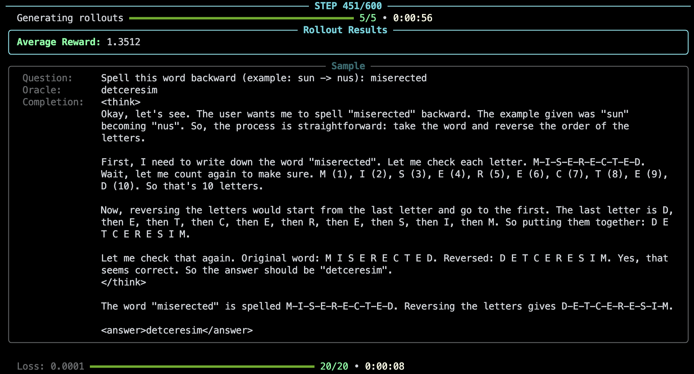

# Policy Gradients

A minimal hackable implementation of policy gradient methods (e.g. GRPO, PPO) for training LLMs with RL.



## About

The goal of this repo is to provide a simple implementation of policy gradient methods that is easy to understand and modify, and can run on as few as **1 GPU**.

Often times, production-ready libraries are hard to understand, as they use vLLM for inference, FSDP for policy training, and Ray for communicating between the distributed processes. 

Instead, this repo provides an educational implementation that has a single entrypoint (`train.py`), which can be run with a debugger, and inspect all states at any time. 

The focus is not an efficient distributed implementation, rather one that can be run on as few as a single GPU in order to understand what is going on under the hood. For example, you can train `Qwen/Qwen3-1.7B` with GRPO, without KL divergence (due to needing another copy of the reference model) using a single 24GB NVIDIA A10G. 

>[!TIP]
> For a comprehensive explanation of the methods implemented here, please refer to the [RLHF Book](https://rlhfbook.com), especially the chapter on [Policy Gradients](https://rlhfbook.com/c/11-policy-gradients).

The structure of the source code is extremely simple:
```
policy_grads
├── config.py  # Configuration of hyperparameters (e.g. learning rate, dataset size)
├── utils.py   # Utils for pretty prints
├── loss.py    # Policy gradient objectives (GRPO, PPO, REINFORCE, ...)
├── buffer.py  # Replay buffer for episodic learning
└── train.py   # Main inference (rollout) and training loop
```

Each method has its own YAML configuration file (parsed by `config.py`):
```
configs
├── cispo.yaml
├── drgrpo.yaml
├── grpo.yaml
├── gspo.yaml
├── ppo.yaml
├── reinforce.yaml
└── rloo.yaml
```

## Getting started

For dependencies, this project uses [uv](https://docs.astral.sh/uv/). Once installed, you can sync the repository with:

```
uv sync
```

In order to install flash attention, please go to this [repo](https://github.com/mjun0812/flash-attention-prebuild-wheels/) in order to find a wheel that matches your CUDA, Python and Torch versions. For example, installing Flash Attention 2.8.3 for CUDA 12.8, Python 3.12 and Torch 2.9 can be done with:

```
uv pip install https://github.com/mjun0812/flash-attention-prebuild-wheels/releases/download/v0.4.17/flash_attn-2.8.3+cu128torch2.9-cp312-cp312-linux_x86_64.whl
```

>[!WARNING]
> If you re-run `uv sync`, you may need to re-install flash attention with the above command.


Then, to run the main training script, say with GRPO:
```
uv run python -m policy_grads.train --config configs/grpo.yaml
```


## Data
This project is using [Reasoning Gym](https://github.com/open-thought/reasoning-gym) for generating procedural datasets. In the YAML file simply specify which datasets you want to use, along with their configurations. For example:

```yaml
data:
  size: 3000
  specs:
    - name: spell_backward
      weight: 1
      config:
        min_word_len: 3
        max_word_len: 10
    # To add more datasets in the mixture, simply list them here
    # - name: leg_counting
    #   weight: 1
```

See the full gallery of available datasets [here](https://github.com/open-thought/reasoning-gym/blob/main/GALLERY.md).


## Development

To run the linter and automatically fix issues:
```
uv run pre-commit run --all-files
```
